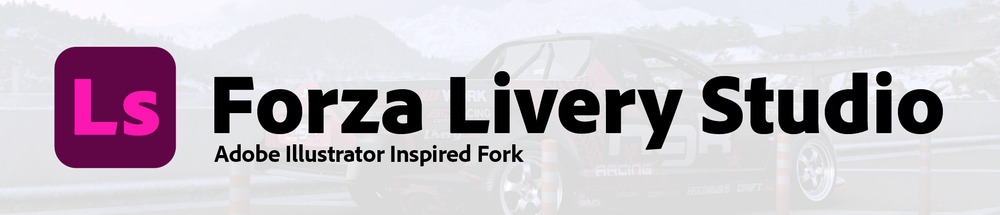

<p align="center">
  
</p>

# Forza Livery Studio

> A fork of [Arstz](https://github.com/Arstz)'s [Forza Livery Studio](https://github.com/Arstz/ForzaLiveryStudio) that reworks the editor to feel closer to **Adobe Illustrator**.

A standalone C++/Qt editor for Forza vinyl groups (and, in the future, *probably* liveries). It **does not** modify game memory at runtime. We are not responsible for any damage done to your groups/liveries — use at your own discretion.

## What's different in this fork
This fork keeps all of the original functionality and focuses on making the editing experience and interface behave like Illustrator.

**Interface**
- The `.exe` launches as a normal windowed app — no extra console window.
- Custom title bar: the minimize / maximize / close buttons sit on the menu-bar row next to the app logo. Native resizing, Aero Snap and maximize still work.
- App logo shown at the top-left of the menu bar.
- Tools moved into a narrow, icon-only strip down the left side.
- Panels rearranged: **Layers** on the left, **Properties** on the right, **Shapes** full-width along the bottom.
- A new flat dark theme in place of the default Windows look (grey chrome, blue accents).

**Selection & editing**
- One unified **Select** tool that selects, moves *and* transforms — scale/rotate/skew handles appear on the artboard around the selection, so there's no need to switch to a separate transform tool.
- Click-drag on empty canvas draws a **marquee** selection.
- **Shift + click** to add/remove objects from the selection.
- **Ctrl + click** to select a single object inside a group instead of the whole group.
- Pixel-accurate selection and hover based on each shape's real geometry (not its bounding box), with a blue outline of the shape under the cursor.

**Navigation**
- **Scroll** pans up/down, **Ctrl + scroll** pans left/right, **Alt + scroll** zooms toward the cursor.
- Space-drag or middle-mouse to pan.

## Features (from the original)
- Import/export to Forza's proprietary binary format
- Save/load projects to JSON files
- Full transformations, for groups as well
- Custom, reusable groups (**Save Custom Shape**)
- Raster image overlay as a guide layer
- Direct shape parity with the game engine
- Written in C++ (**blazingly fast**)

## Install
1. Download the latest release and unzip it somewhere.
2. Run **`ForzaLiveryStudio.exe`**.
3. Arrange the panels how you like and save the layout with **Window → Save Layout**.

The manual lives in [`docs/MANUAL.md`](docs/MANUAL.md). Default shape names can be edited in `assets/vector/shape_names.json`. Settings and custom groups are stored in the registry at `HKEY_CURRENT_USER\Software\ForzaTools\ForzaLiveryStudio`.

## Building from source
**Requirements**
- Windows
- A C++ compiler — MSVC works well (e.g. *Visual Studio 2022*, or the standalone *Build Tools for Visual Studio 2022* with the **Desktop development with C++** workload)
- [CMake](https://cmake.org/) 3.24 or newer
- [vcpkg](https://github.com/microsoft/vcpkg) to provide Qt 6 and zlib

**Steps**

1. Install vcpkg (skip if you already have it). The build scripts default `VCPKG_ROOT` to `C:\vcpkg\vcpkg`; set the `VCPKG_ROOT` environment variable if yours lives elsewhere.
   ```powershell
   git clone https://github.com/microsoft/vcpkg C:\vcpkg\vcpkg
   C:\vcpkg\vcpkg\bootstrap-vcpkg.bat
   ```

2. Install the dependencies. ⚠️ vcpkg builds Qt from source, so the first run can take a while.
   ```powershell
   C:\vcpkg\vcpkg\vcpkg install qtbase:x64-windows qtimageformats[webp]:x64-windows zlib:x64-windows
   ```

3. Clone and build:
   ```powershell
   git clone https://github.com/ttolerantss/ForzaLiveryStudio
   cd ForzaLiveryStudio
   powershell -ExecutionPolicy Bypass -File tools\build.ps1
   ```
   The built app lands at `build\Release\ForzaLiveryStudio.exe`.

4. Run it:
   ```powershell
   powershell -ExecutionPolicy Bypass -File tools\run.ps1
   ```

## Status
Group import/export is fully supported and the core functionality is in place. Liveries can currently only be imported, not exported. The app targets Forza games generally; compatibility may still vary by title, since not every game/version has been verified.

## Credits
- [Arstz](https://github.com/Arstz) — original author of Forza Livery Studio, which this project is a fork of.
- [Fr4g3z](https://github.com/Fr4g3z) - cool guy, helped a lot, complained a lot, format reversing.
- Mixbob - lazy bastard, tested ingame, usage feedback
- Zloysvin - shape renamer
- [Pengyss](https://github.com/Pengyss) - non-uniform group tranform algorithm
- Eaterrius - big money man, provided tokens

This fork is maintained by [ttolerantss](https://github.com/ttolerantss).
