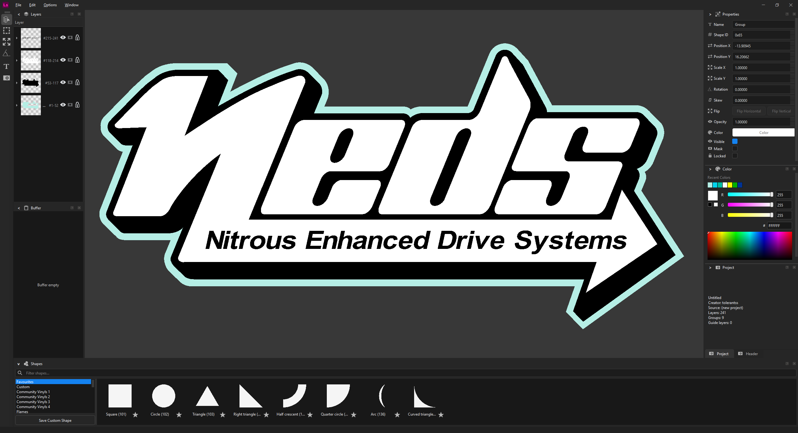

<p align="center">
  
</p>

# Forza Livery Studio

> A fork of [Arstz](https://github.com/Arstz)'s [Forza Livery Studio](https://github.com/Arstz/ForzaLiveryStudio) that reworks the editor to feel closer to **Adobe Illustrator**.

A standalone C++/Qt editor for Forza vinyl groups (and, in the future, *probably* liveries). It **does not** modify game memory at runtime. We are not responsible for any damage done to your groups/liveries — use at your own discretion.

## What's different in this fork
This fork keeps all of the original functionality and focuses on making the editing experience and interface behave like Illustrator.

<p align="center">
  
</p>

**Interface**
- The `.exe` launches as a normal windowed app — no extra console window.
- Custom title bar: the minimize / maximize / close buttons sit on the menu-bar row next to the app logo. Native resizing, Aero Snap and maximize still work.
- App logo shown at the top-left of the menu bar.
- Tools moved into a narrow, icon-only strip down the left side.
- Panels rearranged: **Layers** on the left, **Properties** and a new **Color** panel on the right, **Shapes** full-width along the bottom. Each right-side panel opens sized to its content, with a thin divider between sections.
- A dockable **Color** panel (Illustrator-style): recent colours, R/G/B sliders with live gradient tracks, a hex field, and a hue/value spectrum. Double-click the fill swatch or a recent colour to open the full colour picker. Edits apply live to the selection as a single undo step.
- The **Shapes** browser shows flat tiles and scrolls one full row of shapes at a time, so a scroll never stops halfway between rows.
- A new flat dark theme in place of the default Windows look (grey chrome, blue accents).

**Selection & editing**
- One unified **Select** tool that selects, moves *and* transforms — scale/rotate/skew handles appear on the artboard around the selection, so there's no need to switch to a separate transform tool. The transform box hides while you drag to move and reappears on release.
- Click-drag on empty canvas draws a **marquee** selection; touching any part of a grouped object selects the whole group.
- **Shift + click** to add/remove objects from the selection.
- **Ctrl + click** to select a single object inside a group instead of the whole group.
- Pixel-accurate selection and hover based on each shape's real geometry (not its bounding box), with a blue outline of the shape under the cursor.
- Dragging a multi-selection moves every selected object together, and a selected object stays draggable even when another object overlaps on top of it.
- **Arrow keys** nudge the selection 1px (**Shift + arrow** = 10px).
- **Eyedropper** (**I**, or the button in the Color / Properties panels): click any object to sample its colour onto the selection.
- **Right-click** the canvas for quick actions: Group, Ungroup, Flip Horizontal/Vertical, Rotate 90° CW/CCW, Lock Selection, Unlock All.
- **Flip Horizontal / Flip Vertical** performs a true mirror (an unrotated shape stays at rotation 0), and **Rotate 90°** turns the selection about its center. A whole group flips/rotates as a unit.
- The Properties panel's transform fields (position, scale, rotation, skew) update **live** while you move, scale, or rotate a shape on the canvas.

**Isolation mode**
- **Double-click a group** to enter isolation: only that group's objects are editable, everything behind it is uniformly dimmed, and any layers stacked above it are hidden.
- Inside the group, objects **select individually** — no need to ungroup to edit a single piece.
- **Double-click deeper** to step into nested sub-groups; **Esc** (or double-click empty space) steps back out one level.

**Grouping & organising**
- **Group** (**Ctrl + G**) and **Ungroup** are separate actions — Ctrl+G only ever groups; Ungroup lives in the Edit and right-click menus (no shortcut, so it's never triggered by accident). Any two or more shapes that share a parent can be grouped, even if they aren't adjacent in the stack.
- **Lock** objects so they can't be picked on the canvas — clicks pass straight through to whatever is above or below them. **Ctrl + 2** locks the selection, **Ctrl + 3** unlocks everything.
- **Ctrl + J** duplicates the selection, and **Paste** always lands in front of the original.

**Aligning, arranging & snapping**
- **Align & Distribute** (Edit menu / right-click): align the selection by left/center/right or top/middle/bottom edges, and distribute spacing evenly. Each object or group moves as a unit.
- **Arrange / z-order**: Bring to Front (**Ctrl + Shift + ]**), Bring Forward (**Ctrl + ]**), Send Backward (**Ctrl + [**), Send to Back (**Ctrl + Shift + [**).
- **Smart snapping** (on by default): while dragging, the selection snaps to other objects' edges, centers and corners, and to guides — with a magenta indicator line. Center-to-center snapping makes centering easy. Hold **Ctrl** to bypass. Skewed shapes snap by their real transformed corners.
- **Rotate**: hold **Shift** while rotating to snap to 15° increments.
- **Preview opacity** (right-click → *Preview Opacity*): dim a group or objects on screen to work around them — a **visual-only** aid that never changes the exported in-game colour. Dimming a group flattens it, so overlapping members don't compound.

**Rulers & guides**
- **Ctrl + R** toggles rulers along the top and left edges. **Drag out from a ruler** to create a horizontal or vertical guide line; drag a guide back onto a ruler to remove it, or **Options → Clear Guides**. Guides are editor-only and never exported.
- You can also bring in a raster image as a guide/template layer, then **lock or hide** it to make it a passive backdrop — it won't block selecting or marqueeing objects over it.

**Navigation**
- **Scroll** pans up/down, **Ctrl + scroll** pans left/right, **Alt + scroll** zooms toward the cursor.
- Space-drag or middle-mouse to pan.

**Keyboard shortcuts**

| Shortcut | Action |
| --- | --- |
| `Ctrl + G` | Group selection |
| `Ctrl + J` | Duplicate |
| `Ctrl + 2` / `Ctrl + 3` | Lock selection / Unlock all |
| `Ctrl + ]` / `Ctrl + [` | Bring forward / send backward |
| `Ctrl + Shift + ]` / `Ctrl + Shift + [` | Bring to front / send to back |
| `Shift + H` / `Shift + V` | Flip horizontal / vertical |
| Arrow keys (`Shift` = ×10) | Nudge selection |
| `I` | Eyedropper |
| `Ctrl + R` | Toggle rulers |
| `Ctrl` (while dragging) | Bypass snapping |
| Double-click group · `Esc` | Enter isolation mode · exit one level |
| `Y` | Stamp (duplicate in place) |
| `Ctrl + Z` / `Ctrl + Y` | Undo / Redo |

## Features (from the original)
- Import/export to Forza's proprietary binary format
- Save/load projects to JSON files
- Full transformations, for groups as well
- Custom, reusable groups (**Save Custom Shape**)
- Raster image overlay as a guide layer
- Direct shape parity with the game engine
- Written in C++ (**blazingly fast**)

## Install
1. Download the latest release and unzip it somewhere.
2. Run **`ForzaLiveryStudio.exe`**.
3. Arrange the panels how you like and save the layout with **Window → Save Layout**.

The manual lives in [`docs/MANUAL.md`](docs/MANUAL.md). Default shape names can be edited in `assets/vector/shape_names.json`. Settings and custom groups are stored in the registry at `HKEY_CURRENT_USER\Software\ForzaTools\ForzaLiveryStudio`.

## Building from source
**Requirements**
- Windows
- A C++ compiler — MSVC works well (e.g. *Visual Studio 2022*, or the standalone *Build Tools for Visual Studio 2022* with the **Desktop development with C++** workload)
- [CMake](https://cmake.org/) 3.24 or newer
- [vcpkg](https://github.com/microsoft/vcpkg) to provide Qt 6 and zlib

**Steps**

1. Install vcpkg (skip if you already have it). The build scripts default `VCPKG_ROOT` to `C:\vcpkg\vcpkg`; set the `VCPKG_ROOT` environment variable if yours lives elsewhere.
   ```powershell
   git clone https://github.com/microsoft/vcpkg C:\vcpkg\vcpkg
   C:\vcpkg\vcpkg\bootstrap-vcpkg.bat
   ```

2. Install the dependencies. ⚠️ vcpkg builds Qt from source, so the first run can take a while.
   ```powershell
   C:\vcpkg\vcpkg\vcpkg install qtbase:x64-windows qtimageformats[webp]:x64-windows zlib:x64-windows
   ```

3. Clone and build:
   ```powershell
   git clone https://github.com/ttolerantss/ForzaLiveryStudio
   cd ForzaLiveryStudio
   powershell -ExecutionPolicy Bypass -File tools\build.ps1
   ```
   The built app lands at `build\Release\ForzaLiveryStudio.exe`.

4. Run it:
   ```powershell
   powershell -ExecutionPolicy Bypass -File tools\run.ps1
   ```

## Status
Group import/export is fully supported and the core functionality is in place. Liveries can currently only be imported, not exported. The app targets Forza games generally; compatibility may still vary by title, since not every game/version has been verified.

## Credits
- [Arstz](https://github.com/Arstz) — original author of Forza Livery Studio, which this project is a fork of.
- [Fr4g3z](https://github.com/Fr4g3z) - cool guy, helped a lot, complained a lot, format reversing.
- Mixbob - lazy bastard, tested ingame, usage feedback
- Zloysvin - shape renamer
- [Pengyss](https://github.com/Pengyss) - non-uniform group tranform algorithm
- Eaterrius - big money man, provided tokens

This fork is maintained by [ttolerantss](https://github.com/ttolerantss).
